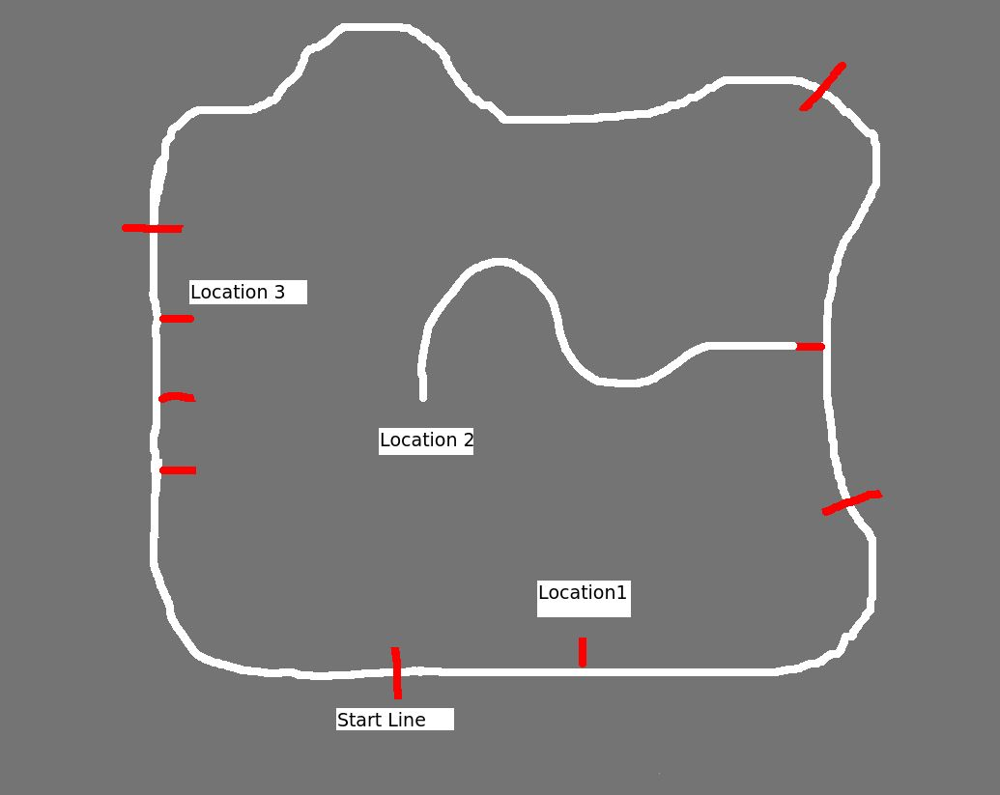
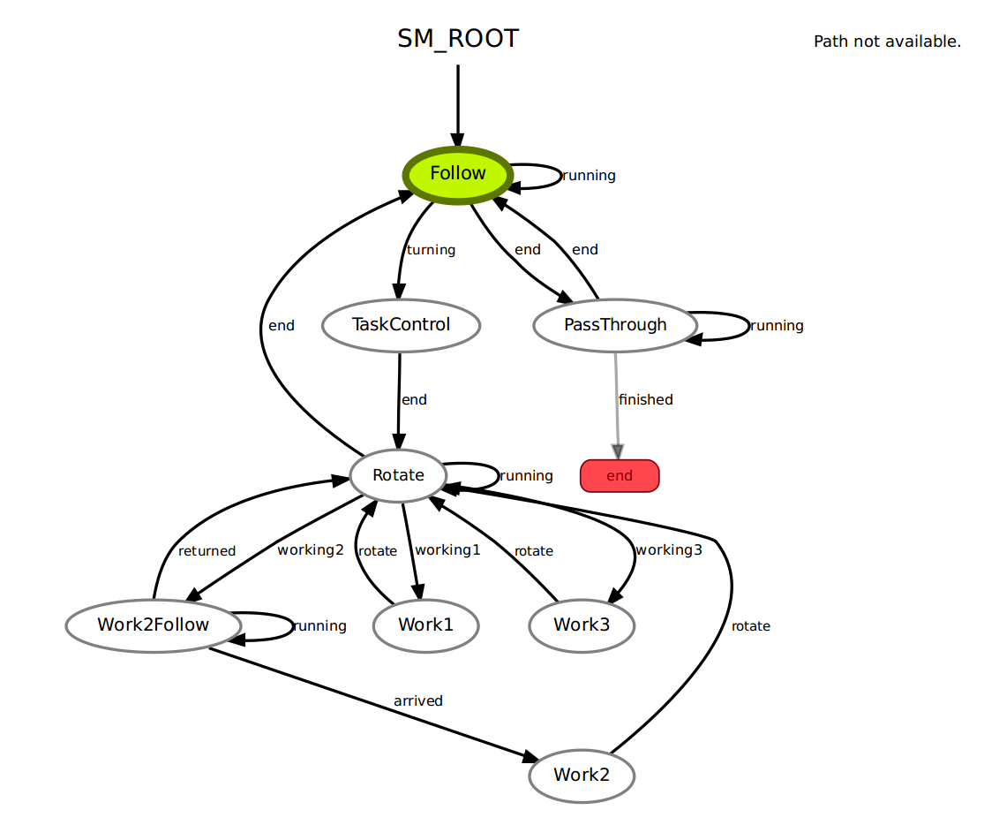
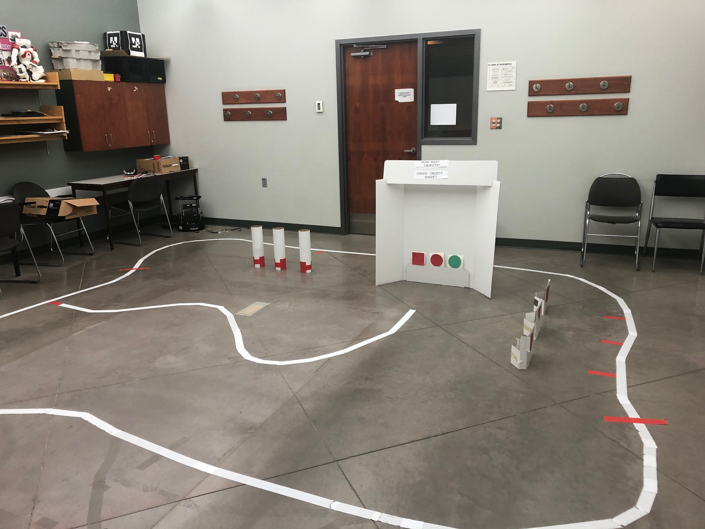

# CMPUT412 FALL 2019 - competition two report
_**Purpose**_

A race track shaped loop has been with a solid white line marking the path to follow. When travelling in the counterclockwise (CCW) direction, red stop lines indicate where the robot should stop. The robot will be initially placed in full stop at the first stop line. The robot must stay on the line while looping around the track. There are four stop lines, once you have done a full loop and reach the start stop line then one run is done.

There are 3 locations for the robot to get extra points. Location 1 is marked by a short red line adjacent to the track, the robot has the chance to earn points by counting the number of objects (one, two, or three) at this location. Location 2 is down a detour, marked by a red line adjacent to the track, again the robot has the chance to earn points by counting the number of objects (one, two, or three) and determining the shape of the green object. Location 3 has three separate red line markers, one for each shape (square, circle, triangle). See Fig 1 below for sketch of the course. The robot will stop at the shape found at Location 2.



Location 1: The first object counting location is located 90 degrees CCW from the line. The robot can count the number of objects without leaving the line. After counting the objects, the robot should display the count using both the LEDs and sound. For example, two objects should be displayed as two LEDs turned on, and two sounds (beeps or your choice). [ ] Correct object count indicated by LEDs and Sounds

 Location 2: The second object counting location is also located 90 degrees CCW from the line, but the objects are placed at the end of an additional white line (e.g. a path leading to a dead end with the objects). The objects will be shapes (circle, triangle or square), and two will be red and one will be green, see Fig 5. Should you choose to attempt this second counting task, the robot will follow this path, and count the objects as before.

Location 3: The final challenge is to determine the shape of the green object at Location 2 (circle, square, or triangle) and find its matching shape at one of three possible positions at Location 3, on the second half of the course. The shapes at Location 3 will be red. When the robot find the matching object shape it must make a sound to signal the shape has been found. The robot must be facing the matching shape so that judges know which one has been picked.

## _**Pre-requisites**_

-   The project is built with python2.7 on Ubuntu 16.04. Dependencies include ROS kinetic package, smach state machine, and other drivers for the turtle bot sensor. If these are not installed please refer to the official installation page on ROS wiki or official python installation websites.
        
    -   Kobuki  [http://wiki.ros.org/kobuki/Tutorials/Installation/kinetic](http://wiki.ros.org/kobuki/Tutorials/Installation/kinetic)
        
    -   Ros-Kinetic  [http://wiki.ros.org/kinetic/Installationu](http://wiki.ros.org/kinetic/Installationu)
        
    -   Python2  [https://www.python.org/downloads/](https://www.python.org/downloads/)
        
    -   Smach  [http://wiki.ros.org/smach](http://wiki.ros.org/smach)
        
        The source code of the project can be found at  [https://github.com/TianqiCS/CMPUT412-C2](https://github.com/TianqiCS/CMPUT412-C1)  Create or navigate the existing catkin workspace and clone our repository.
       

## _**Execution**_

-   Once you have the package in your workspace
    
    ```
    cd catkin_ws
    catkin_make
    source devel/setup.bash
    
    ```
    rename the folder to c2 
    now you can launch the program using
    
    
    $roslaunch c2 c2.launch
    
    
-   arguments and parameters In the launch file c2.launch, the file will launch basic driver for the kuboki robot which is essential for the competition ( minimal.launch and 3dsensor.launch). Next, the file will bring up the basic node for this competition like main file and a usb camera. Finally, there are different sections for in the launch file like example.yaml to give the uvc camera  a basic understanding of view.   
   
## _**Concepts and Strategy**_

-    our basic strategy is using pid controller to follow lines and opencv contour shape detection to detect shapes, referenced from https://www.pyimagesearch.com/2016/02/08/opencv-shape-detection/ and https://github.com/TianqiCS/CMPUT-412-Demo3
-    Here are the details:
-    Firstlly, the robot will initilize the inital yam value for the whole run and approaching the first red line as it following the white line.
-    As the robot is running, it will find out whether there is a red long line(which means stop) or a red short line(which means detecting the image)
-    For different working tasks, the difference is based on the global variable of "current_work"
-    The state machine will have some kind of work flow like this:
        - 1. Following state will keep the robot following the white line
        - 2. If the robot hit a long red line it will enter the PassThrough state to perform a stop at the long red line
        - 3. If the robot hit a short red line it will enter the TaskControl state to determine how many 90 degrees it should trun and then it goes into Rotate state which controls the robot's rotation based on the yaw value.
        - 4. In the Rotate state, the robot will determine what kind of work it will do based on current value.
        - 5. For the task to count number of white tubes, the robot will detect how many red/green contours are in the front and indicate the number by Led lights and sound.
        - 6. The robot remembres what shape the green contour is in location 2.
        - 7. The robot will go through all the shapes when selecting the shapes. If it found the right one it will make a turn on a light and make a sound.
        - 8. The run is ended when the robot is back to the starting line 



#### Notes:
-    We put additional usb camera at the front of the turtle_bot to follow the white line on the ground and the asus camera is used to detect shape of the target.
-    In the function usb_callback, we use the usb camera to detect whether we have a long red line to  short red line. The method is that if it is a long red line there won't be any white in the middle of the track. We think its quicker and easier to identify the difference between two lines.
-    If the object cannot be included into the camera, the robot can back up a little bit to fit the camera view into the right position.
-    Used cv2.pyrMeanShiftFiltering to blur image when detect contours' shapes, but this caused lag.
-    To ensure shape detect result is correct, we detect twice with a few seconds gap to check if results are the same.

#### Sources
- https://github.com/jackykc/comp5
- https://github.com/cmput412
- https://github.com/bofrim/CMPUT_412
- https://github.com/nwoeanhinnogaehr/412-W19-G5-public
- https://github.com/stwklu/CMPUT_412_code/
- https://www.pyimagesearch.com/2016/02/08/opencv-shape-detection/

#### Competition Photos

